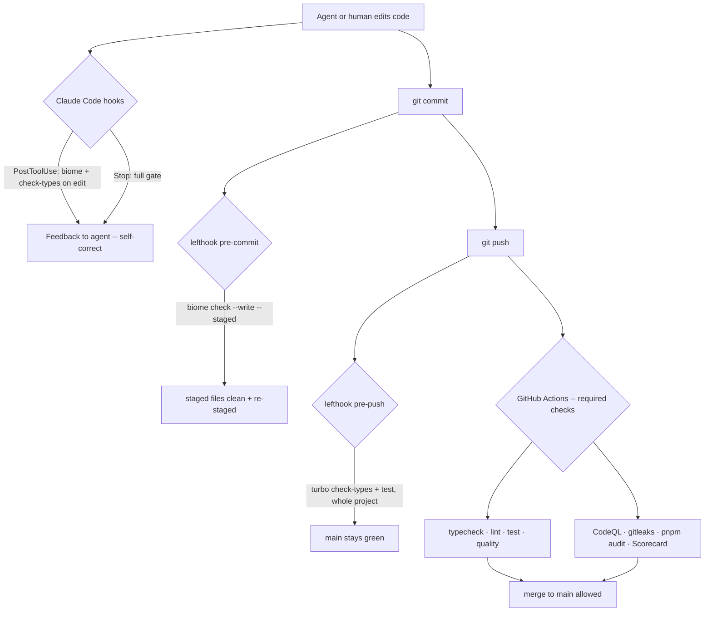

# feat: Foundation increment 1 — monorepo skeleton + guardrails + quality/security gate

## Summary

Stand up silo's TypeScript monorepo skeleton and the guardrails that make bad code un-landable, before any feature code. This increment delivers a real pnpm + Turborepo workspace (five placeholder packages wired by the decided architecture), a strict type + lint + format + test + code-quality + security gate enforced locally (lefthook) and in CI (GitHub Actions), `docs/rules/` coding conventions with Claude Code hooks that enforce them, and the OSS-essential community files under an MIT license.

## Problem Frame

`docs/foundation.md` and CLAUDE.md gate all feature work behind three engineering-foundation items in order: guardrails, data architecture, tooling. This plan executes the **first** increment — the monorepo skeleton plus guardrails (items 1 and 3; the data model is increment 2 and stays deferred). The build philosophy demands "bad code cannot land unnoticed" from the start, and the project is going open-source, so the quality/security gate and community files are cheapest to establish now, before there is any code to clean up or any contributor to onboard.

The stack is already decided in the origin requirements doc: TypeScript everywhere, Postgres, a framework-agnostic `packages/core` with thin `web` / `api` / `mcp/server` adapters. This plan builds the empty shell of that architecture and the enforcement around it — not the operations inside it.

---

## Requirements

### Workspace skeleton
- R1. The repo is a pnpm workspace + Turborepo monorepo with five packages matching the decided architecture: `packages/core`, `packages/db`, `packages/api`, `packages/web`, `packages/mcp/server`, plus a shared config package `packages/tsconfig` (see origin: docs/brainstorms/2026-07-03-engineering-foundation-requirements.md).
- R2. Packages are wired with the `workspace:*` protocol; the workspace glob lists `packages/*` and the explicit `packages/mcp/*` (never a recursive `packages/**`).
- R3. Each package is a minimal but real, typechecking, testable placeholder — enough to make the workspace graph and the gate meaningful, containing no feature logic.
- R4. `turbo.json` defines `build`, `check-types`, `lint`, `test`, and `quality` tasks with correct `dependsOn` / `outputs`, using the v2 `tasks` key.

### Type + lint + format
- R5. A shared strict `tsconfig` base (`strict` plus `noUncheckedIndexedAccess`, `exactOptionalPropertyTypes`, `verbatimModuleSyntax`, `isolatedModules`, `noEmit`) is extended by every package; `web` extends a React variant, Node packages a node variant.
- R6. Biome v2 is the sole lint + format + import-organize tool, configured strict, with the `react` and `test` domains enabled.
- R7. Import-boundary rules enforce the architecture: `web` / `api` / `mcp` may depend on `core` but not on each other or on `db` directly; `core` owns data access.

### Code quality (DRY / abstraction / dead code)
- R8. Duplication detection (jscpd) fails CI when copy-paste exceeds a set threshold.
- R9. Complexity ceilings (Biome cognitive-complexity rule) and dead-code detection (knip for unused files/exports/deps) run in the gate.
- ~~R10. Spell-check (cspell)~~ — dropped 2026-07-03 (maintaining a domain-word dictionary is more nuisance than value at this stage). The gate is Biome + boundaries + jscpd + knip.

### Enforcement (local + CI + agent)
- R11. lefthook runs Biome on staged files at pre-commit (auto-fix + re-stage) and `check-types` + `test` on the whole project at pre-push; it never runs `tsc` on staged-files-only.
- R12. A GitHub Actions CI workflow mirrors the local gate (typecheck, lint, test, quality) so it cannot be bypassed with `--no-verify`, and is a required status check on `main`.
- R13. `docs/rules/` holds one coding-convention file per stack area, referenced from CLAUDE.md; Claude Code hooks give the agent fast per-edit feedback (PostToolUse) and a done-gate (Stop).

### Security (public repo)
- R14. Dependency and secret scanning: Dependabot, `pnpm audit` in CI, and gitleaks secret-scanning.
- R15. CodeQL SAST runs on every PR for JavaScript/TypeScript.
- R16. OpenSSF Scorecard runs on a schedule and all GitHub Actions are SHA-pinned.
- R17. PR hygiene: conventional-commit PR-title lint, CODEOWNERS, and required status checks are configured.

### OSS essentials
- R18. The repo ships MIT `LICENSE`, a real `README`, `CONTRIBUTING.md`, `CODE_OF_CONDUCT.md`, `SECURITY.md`, `.editorconfig`, `CODEOWNERS`, and `.github/` issue + PR templates from the first public-ready commit.

---

## Key Technical Decisions

- Monorepo manager — pnpm workspaces + Turborepo: matches the decided architecture and CLAUDE.md's scoped-path rule. `turbo.json` uses the v2 `tasks` key (not the removed `pipeline`); `check-types` carries `outputs: []` since it is `--noEmit`.
- Nested package path via explicit glob — `packages/mcp/server` is supported only because the workspace lists `packages/mcp/*` explicitly. Turborepo does not support recursive `packages/**`; this reconciles the nested-path CLAUDE.md rule with the tool constraint.
- Internal deps use `workspace:*` — the pnpm-native default for never-independently-published packages; simplest for a pre-OSS repo.
- Shared tsconfig via a config package + `extends`; **skip TypeScript project references** — Turborepo already provides the cross-package build graph and caching, so `tsc -b` orchestration is redundant. Adopt project references only on a concrete future need.
- Scaffold on stable `tsc` (TS 5.9), not TS 7 / `tsgo` — `tsgo` GA'd but is still stabilizing with ecosystem edge cases. The `--noEmit` `check-types` task design is identical either way, so `tsgo` drops in later as an accelerator without a redesign.
- Biome v2 as the sole lint + format tool — v2 closed the historic React and type-aware-rule blockers and is mature for a greenfield TS+React repo; one fast tool beats an ESLint+Prettier stack. Known caveat: Biome's type-aware rule set is narrower than typescript-eslint — if a specific rule (e.g. `no-floating-promises`) proves missing, revisit adding ESLint narrowly. `organizeImports` lives under `assist.actions.source` in v2.
- lefthook as the single git-hook manager (no lint-staged) — Go binary, parallel, first-class monorepo globbing; its built-in `{staged_files}` replaces lint-staged. Correctness rule baked in: Biome on staged files, but `tsc` + tests on the whole project (feeding the checker only staged files gives misleading results).
- Defense in depth for enforcement — Claude Code hooks are advisory agent feedback (PostToolUse cannot block a completed tool call); lefthook + CI are the actual un-bypassable gate. CI mirrors the exact lefthook commands so `--no-verify` cannot defeat it.
- Coverage strategy — the gate runs tests per-package through Turborepo (fast, cached); a separate root `vitest run --coverage` job produces merged coverage, because Vitest computes coverage per-process at root only, not per-project.
- Import boundaries enforced mechanically — via Biome `noRestrictedImports` and/or a dependency-cruiser CI check, so the core/adapter separation is a build failure, not a convention.
- MIT license — permissive, familiar, maximum adoption; the default for a personal TS/JS tool.

---

## High-Level Technical Design

### Enforcement layers (defense in depth)



Claude hooks = fast corrective loop while building. lefthook = the committer-facing gate. CI = the un-bypassable backstop mirroring lefthook, plus the security jobs that only make sense centrally.

### Workspace task graph

`turbo run check-types lint test quality` fans out across packages with caching; `^build` ordering applies only where a dependency's build output is needed. Placeholder packages keep the graph real so the gate exercises the whole workspace from day one.

---

## Output Structure

```text
silo/
  package.json                 # root: scripts, devDeps, packageManager
  pnpm-workspace.yaml          # packages/* + packages/mcp/* + catalog
  turbo.json                   # v2 tasks: build/check-types/lint/test/quality
  biome.json                   # strict, react+test domains, assist organizeImports
  lefthook.yml                 # pre-commit (biome staged) + pre-push (types+test)
  vitest.config.ts             # root projects: packages/* + packages/mcp/*
  cspell.json                  # project dictionary
  .jscpd.json                  # duplication threshold
  knip.json                    # unused files/exports/deps config
  .editorconfig
  .gitignore
  LICENSE                      # MIT
  README.md
  CONTRIBUTING.md
  CODE_OF_CONDUCT.md
  SECURITY.md
  CODEOWNERS
  .github/
    workflows/
      ci.yml                   # typecheck · lint · test · quality · coverage
      codeql.yml               # SAST
      security.yml             # gitleaks · pnpm audit
      scorecard.yml            # OpenSSF Scorecard (scheduled)
    dependabot.yml
    ISSUE_TEMPLATE/
      bug_report.md
      feature_request.md
    pull_request_template.md
  .claude/
    settings.json              # PostToolUse + Stop hooks
    hooks/
      check-edited.sh
      gate.sh
  docs/
    rules/
      typescript.md
      react.md
      api-hono.md
      db-drizzle.md
      testing.md
  packages/
    tsconfig/                  # shared base.json / react.json / node.json
    core/                      # placeholder — the future brain
    db/                        # placeholder — schema/migrations later
    api/                       # placeholder — Hono adapter later
    web/                       # placeholder — Vite+React later
    mcp/
      server/                  # placeholder — MCP adapter later
```

The tree is a scope declaration; per-unit `Files` sections are authoritative. The implementer may adjust layout if implementation reveals a better shape.

---

## Implementation Units

Units are dependency-ordered. Each is independently landable and committed on completion (per CLAUDE.md continuous-commit rule). Build stage is delegated to a Sonnet subagent per the method file (CLAUDE.md orchestration rule).

### U1. Workspace skeleton + shared tsconfig

- Goal: a working pnpm + Turborepo monorepo with the shared tsconfig package and correct workspace globs.
- Requirements: R1, R2, R4, R5.
- Dependencies: none.
- Files: `package.json`, `pnpm-workspace.yaml`, `turbo.json`, `.gitignore`, `packages/tsconfig/package.json`, `packages/tsconfig/base.json`, `packages/tsconfig/react.json`, `packages/tsconfig/node.json`.
- Approach: root `package.json` sets `packageManager: pnpm@...`, `private: true`, and the turbo scripts (`build`, `check-types`, `lint`, `test`, `quality`). `pnpm-workspace.yaml` lists `packages/*` and `packages/mcp/*` plus a `catalog:` pinning shared versions (typescript, vitest, biome). `turbo.json` uses the v2 `tasks` key with `check-types` → `outputs: []`. The shared tsconfig exports the three variants from KTD (strict base, react, node).
- Patterns to follow: Turborepo "structuring a repository" — no root tsconfig beyond the shared package; each package extends it.
- Test scenarios: Test expectation: none — pure scaffolding/config, no behavior. Verification covers it.
- Verification: `pnpm install` resolves the workspace; `pnpm turbo run check-types` runs with zero packages failing (empty graph is a pass); the `packages/mcp/*` glob resolves once U2 lands.

### U2. Five placeholder packages wired by architecture

- Goal: minimal real packages (`core`, `db`, `api`, `web`, `mcp/server`) that typecheck and expose a trivial test, wired with `workspace:*`.
- Requirements: R1, R2, R3.
- Dependencies: U1.
- Files: `packages/core/package.json`, `packages/core/src/index.ts`, `packages/core/src/index.test.ts`, `packages/core/tsconfig.json`; the same four-file shape for `packages/db`, `packages/api`, `packages/web`, `packages/mcp/server` (web extends the react tsconfig variant, the rest node).
- Approach: each `index.ts` exports one trivial placeholder (e.g. a `version` constant or a named marker function) so the package is importable and typechecks — no feature logic. `api` declares a `workspace:*` dep on `core` to prove the graph edge; `web` too. Each `package.json` has `check-types`, `lint`, `test` scripts. This makes the gate exercise a real multi-package graph.
- Patterns to follow: identical package shape across all five so conventions are obvious to contributors.
- Test scenarios:
  - Happy path: each package's `index.test.ts` imports its own placeholder export and asserts it is defined — proves the package builds, resolves, and Vitest runs in it.
  - Integration: a test in `api` imports the `core` placeholder via `workspace:*` and asserts it resolves — proves the workspace link works end to end.
- Verification: `pnpm turbo run check-types test` passes across all five packages; removing the `core` dep from `api` breaks its import (link is real, not incidental).

### U3. Biome + import boundaries + code-quality tooling

- Goal: strict Biome lint/format, enforced import boundaries, and the DRY/complexity/dead-code/spell tooling — all runnable as a `quality` task.
- Requirements: R6, R7, R8, R9, R10.
- Dependencies: U2.
- Files: `biome.json`, `.jscpd.json`, `knip.json`, `cspell.json`, `dependency-cruiser` config (`.dependency-cruiser.cjs`) if used for boundaries, `turbo.json` (add `quality` task), root `package.json` (quality devDeps + script).
- Approach: `biome.json` per the researched strict baseline — `assist.actions.source.organizeImports: on`, `domains: { react, test }`, cognitive-complexity rule enabled, `noRestrictedImports` encoding the boundary rules (web/api/mcp → core only; nobody → db except core). Add dependency-cruiser as the authoritative boundary check if Biome's restricted-imports proves too coarse for path-based rules. jscpd threshold set conservatively (e.g. fail above ~1.5% duplication); knip configured for the workspace; cspell with a `project-words` dictionary. The `quality` turbo task runs biome check + jscpd + knip + cspell.
- Patterns to follow: researched `biome.json` baseline; boundary rules mirror the KTD architecture split.
- Test scenarios:
  - Happy path: `pnpm turbo run quality` passes clean on the placeholder packages.
  - Error path: a deliberately-added `import` from `web` into `db` fails the boundary check (temporarily added, then removed — proves the rule bites).
  - Error path: a duplicated block above threshold fails jscpd; an unused export fails knip; a misspelled identifier fails cspell. (Each verified once during implementation, not committed.)
- Verification: the `quality` task is green on the real tree and red on each injected violation above.

### U4. Local enforcement — lefthook + Claude Code hooks + docs/rules

- Goal: the committer-facing gate (lefthook) and the agent-facing feedback loop (Claude hooks), plus the `docs/rules/` conventions they enforce.
- Requirements: R11, R13.
- Dependencies: U3.
- Files: `lefthook.yml`, `.claude/settings.json`, `.claude/hooks/check-edited.sh`, `.claude/hooks/gate.sh`, `docs/rules/typescript.md`, `docs/rules/react.md`, `docs/rules/api-hono.md`, `docs/rules/db-drizzle.md`, `docs/rules/testing.md`, CLAUDE.md (link the rules files).
- Approach: `lefthook.yml` — pre-commit runs `biome check --write --staged {staged_files}` with `stage_fixed: true`; pre-push runs `turbo run check-types` and `turbo run test` (whole project, never staged-only). `.claude/settings.json` wires PostToolUse on `Edit|Write` of `*.{ts,tsx}` to `check-edited.sh` (biome on the edited file + `turbo run check-types`, `exit 2` with stderr on failure so the agent self-corrects), and a Stop hook to `gate.sh` (full `turbo run check-types lint test quality`). `docs/rules/*.md` each carry explicit Do/Don't + forbidden patterns; CLAUDE.md links them so every build brief loads them.
- Patterns to follow: existing `~/.claude/skills/guard` and `~/.claude/skills/careful` hook pattern (PreToolUse matcher + command script) adapted to PostToolUse/Stop.
- Test scenarios:
  - Happy path: a commit with a formatting issue is auto-fixed and re-staged by pre-commit; a push with clean code passes pre-push.
  - Error path: a commit containing an unfixable lint error is rejected by pre-commit; a push with a type error is rejected by pre-push.
  - Integration: editing a `.ts` file with a type error via the agent triggers the PostToolUse hook and surfaces the error back (manual verification during implementation).
  - Test expectation for docs/rules files: none — documentation, no behavior.
- Verification: hooks fire on real commit/push attempts and block on violations; `gate.sh` reproduces the CI gate locally.

### U5. CI — quality gate + security workflows

- Goal: GitHub Actions mirroring the local gate plus the OSS security jobs, as required status checks.
- Requirements: R12, R14, R15, R16, R17.
- Dependencies: U4.
- Files: `.github/workflows/ci.yml`, `.github/workflows/codeql.yml`, `.github/workflows/security.yml`, `.github/workflows/scorecard.yml`, `.github/dependabot.yml`, `CODEOWNERS`.
- Approach: `ci.yml` sets up pnpm + Node, restores the turbo cache, and runs `turbo run check-types lint test quality` plus a separate root `vitest run --coverage` job with a coverage comment. `codeql.yml` runs CodeQL for `javascript-typescript` on PR + push. `security.yml` runs gitleaks and `pnpm audit`. `scorecard.yml` runs OpenSSF Scorecard on schedule. All action `uses:` are SHA-pinned (R16). `dependabot.yml` covers the pnpm ecosystem + github-actions. A PR-title conventional-commit check runs in `ci.yml`. CODEOWNERS assigns review to `@amitray007`. Document that branch protection must require these checks on `main` (R17 — repo setting, noted for the maintainer).
- Patterns to follow: GitHub's official starter workflows for CodeQL and Scorecard, adapted and SHA-pinned.
- Test scenarios:
  - Happy path: CI is green on the placeholder tree across all jobs.
  - Error path: a PR that fails typecheck/lint/quality is blocked by the required `ci` check (verified via a scratch PR or `act`, or on first push).
  - Test expectation: none beyond the workflow runs themselves — CI config, verified by execution.
- Verification: all workflows run green on an initial push; each required check appears in branch-protection settings; SHA-pins present on every `uses:`.

### U6. OSS essentials — license + community files

- Goal: the community-standard files that make the public repo coherent from its first shared commit.
- Requirements: R18.
- Dependencies: none (can land in parallel with U1–U5; sequenced last to reference final tooling in CONTRIBUTING).
- Files: `LICENSE`, `README.md`, `CONTRIBUTING.md`, `CODE_OF_CONDUCT.md`, `SECURITY.md`, `.editorconfig`, `.github/ISSUE_TEMPLATE/bug_report.md`, `.github/ISSUE_TEMPLATE/feature_request.md`, `.github/pull_request_template.md`.
- Approach: MIT `LICENSE` (copyright holder = the maintainer, year 2026). `README` states what silo is (from the scope map), the architecture, and how to run the gate locally. `CONTRIBUTING.md` documents the workspace layout, the `docs/rules/` contract, and the commit/PR conventions (conventional commits, the green-gate expectation). `CODE_OF_CONDUCT.md` uses the Contributor Covenant. `SECURITY.md` gives a private disclosure path. Issue/PR templates align with the PR-title lint from U5. `.editorconfig` matches Biome's indent/line-width so editors and the formatter agree.
- Patterns to follow: Contributor Covenant for CoC; keep README/CONTRIBUTING anchored to the real scope docs, not boilerplate.
- Test scenarios: Test expectation: none — documentation and license files, no behavior.
- Verification: GitHub's community-standards checklist shows all files detected; `.editorconfig` values match `biome.json` (no editor-vs-formatter fight).

---

## Scope Boundaries

### In this increment
Skeleton, guardrails, quality + security gate, agent-enforcement hooks, `docs/rules/`, and OSS-essential community files under MIT. Foundation items 1 (guardrails) and 3 (tooling) from `docs/foundation.md`.

### Deferred for later (origin: docs/brainstorms/2026-07-03-engineering-foundation-requirements.md)
- Foundation item 2 — the data architecture: `links` / `tags` / `source_data` Drizzle schema, migrations, dedup/canonicalization, trash/purge, capture-status states. The next increment; `packages/db` and `packages/core` stay empty placeholders here.
- Extraction (metascraper + Readability + Playwright), pg-boss jobs, the semantic index, the plugin system, and the MCP tool implementations — all later increments on this base.

### Deferred to follow-up work (plan-local)
- Full OSS launch polish: docs site, release automation (changesets), npm publishing, badge polish. Explicitly out of "essentials now" per the OSS-scope decision.
- `tsgo` adoption as a typecheck accelerator once the dep tree is validated against TS 7.
- Narrow ESLint addition — only if a specific type-aware rule proves missing from Biome.

### Outside this product's identity (origin)
No AI inside silo, not a file store, not a content archive, not multi-user, no read-later queue.

---

## Risks & Dependencies

- Biome type-aware rule breadth — Biome v2's type-aware rules are narrower than typescript-eslint. Risk: a rule you want (e.g. `no-floating-promises`) may be absent. Mitigation: verify needed rules exist during U3; the narrow-ESLint escape hatch is recorded in Scope Boundaries.
- Turborepo nested-glob constraint — using `packages/**` would silently break workspace resolution. Mitigation: R2 mandates the explicit `packages/mcp/*` glob; called out in U1.
- Staged-vs-whole-project checking — running `tsc` on staged files only yields misleading pass/fail. Mitigation: R11 and U4 hard-separate Biome (staged) from typecheck/test (whole project).
- CI required-checks are a repo setting, not code — branch protection requiring the `ci` check must be enabled by the maintainer; the plan documents it (U5) but cannot enforce it from the tree.
- Fast-moving versions — Biome 2.3.x, Vitest 4.x, Turborepo 2.x, TS 5.9 are current as of the research (July 2026). Pin versions via the pnpm catalog (U1) so the toolchain is reproducible.

---

## Sources & Research

- Turborepo structuring + configuration (v2 `tasks` key, no recursive globs, no root tsconfig) — informed U1, R2, R4.
- Biome v2 ("Biotype") release, domains, and configuration references — informed R6, U3, the `biome.json` baseline and the `assist.actions.source.organizeImports` placement.
- lefthook vs Husky vs lint-staged comparison — informed the lefthook KTD and R11.
- Vitest `projects` field (workspace config deprecated) + root-only coverage — informed the coverage KTD and U5.
- TypeScript strict-superset tsconfig reference + TS 7 / `tsgo` status — informed R5 and the scaffold-on-stable-tsc KTD.
- Claude Code hooks (PostToolUse cannot block; `exit 2` feeds stderr back) — informed R13 and U4; the existing `guard`/`careful` skills at `~/.claude/skills/` are the reusable hook pattern.
