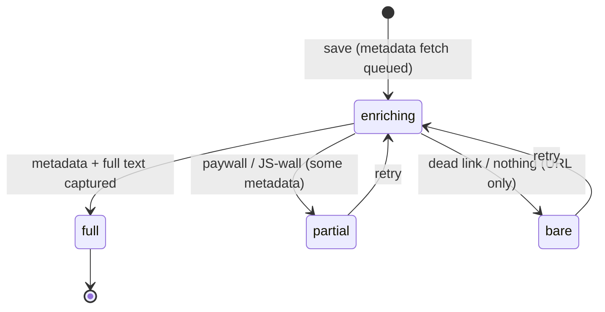
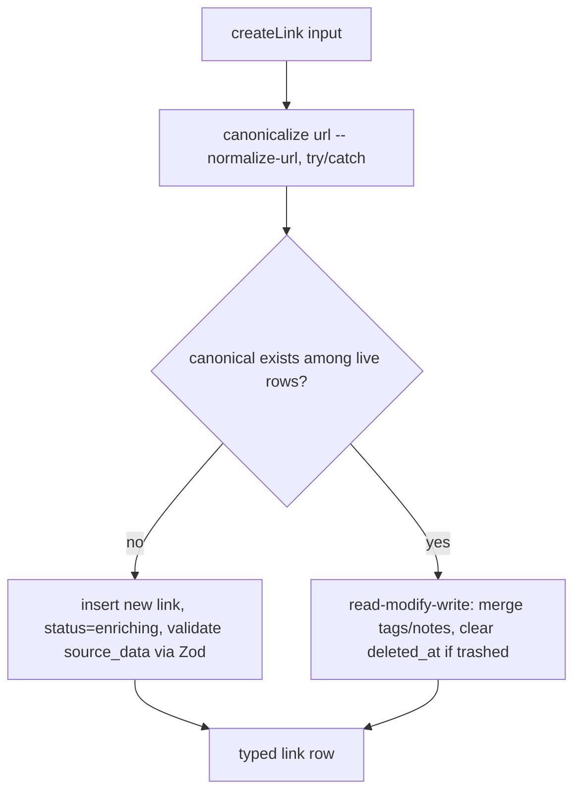

# feat: Foundation increment 2 — data architecture

## Summary

Build silo's data layer in `packages/db` (Drizzle + Postgres) and the low-level data-access + validation primitives in `packages/core`. Delivers the `links` / `tags` / `link_tags` / `source_data` JSONB schema, migrations, URL canonicalization + dedup, soft-delete trash with a partial-unique index, capture-status states, and Postgres full-text search via a generated `tsvector` column. Designed MCP-answerable and pgvector-ready. This satisfies foundation item 2 in `docs/foundation.md`.

## Problem Frame

Foundation item 1 (skeleton + guardrails) is done; `packages/db` and `packages/core` are empty placeholders. This increment gives them a real, queryable data model — the substrate every later increment (extraction, MCP surface, plugins, semantic index) builds on. It stops at the schema and the query primitives: the higher-level save/enrichment orchestration, extraction, MCP tools, and job scheduling are later increments that call into what this builds.

The data-model shape is already decided in the origin doc: stable typed columns plus a `source_data` JSONB column whose per-source shape is a Zod schema, so adding a source field is a one-file change with no migration.

---

## Requirements

### Schema
- R1. A `links` table with stable typed columns: id, raw url, canonical url, title, description, image url, site name, extracted text, source kind, capture status, notes, timestamps (created/updated), and soft-delete `deleted_at` (see origin: docs/brainstorms/2026-07-03-engineering-foundation-requirements.md).
- R2. A `source_data` JSONB column typed per-source by a Zod discriminated union keyed on source kind; adding a source field extends one Zod schema with no DB migration.
- R3. `tags` and a `link_tags` many-to-many join table; one link holds many tags.
- R4. One free-form `notes` field per link (not a separate table).

### Dedup + canonicalization
- R5. Each link stores both the raw `url` and a normalized `canonical_url`; canonicalization strips tracking params (utm_*, fbclid, gclid, etc.) and normalizes scheme/host/trailing-slash/query-order.
- R6. Dedup is enforced by a partial-unique index on `canonical_url WHERE deleted_at IS NULL` — one live URL = one item; a trashed/purged URL frees the slot.
- R7. A malformed URL still saves (canonical falls back to raw) rather than failing.

### Capture status + soft delete
- R8. Capture status is a typed enum: `enriching` (transient), `full`, `partial`, `bare` (terminal), where `partial`/`bare` are retryable.
- R9. Soft delete sets `deleted_at`; a live-query helper (`deleted_at IS NULL`) is shared so no query forgets it. Restore clears `deleted_at`.
- R10. The purge query deletes trashed rows older than a configurable window, in bounded batches. (Scheduling is deferred; the query is built and tested.)

### Full-text search
- R11. A generated `tsvector` column over title (weight A) + description (B) + extracted text (C), kept in sync by Postgres, with a GIN index (partial, live rows only).
- R12. Search uses `websearch_to_tsquery` (safe on raw user input) and ranks by `ts_rank`.

### Core primitives
- R13. `packages/core` exposes typed data-access primitives over the schema: create a link (dedup-aware, merges tags/notes on re-save), find by canonical url, get by id, list/filter, full-text search, edit metadata, tag/untag, soft-delete/restore. These are the operations the UI and MCP will later reuse.
- R14. All writes validate input through Zod at the boundary (including `source_data` against the per-source union); reads return typed rows.

### Migrations + readiness
- R15. Migrations are generated files (drizzle-kit `generate`), committed and reviewed, applied via a programmatic `migrate` entry; `push` is never used for shared state.
- R16. An early migration enables the `vector` extension and the schema reserves a clean path for a future `link_embeddings` table — pgvector bolts on later with no rework.

---

## Key Technical Decisions

- Drizzle stable line, not v1 RC — build on `drizzle-orm@0.45.2` + `drizzle-kit@0.31.10`. The schema-authoring APIs used here (`.$type`, `customType`, `generatedAlwaysAs`, partial indexes, `vector`) are stable and carry forward to v1 unchanged; v1's breaking changes are in the relational query builder and migration-folder layout, which this increment doesn't depend on. Re-evaluate only if v1 goes stable before ship.
- JSONB typing is two independent layers — `jsonb().$type<SourceData>()` gives compile-time types only (no runtime check); a Zod discriminated union (keyed on source kind) validates at the write boundary. The discriminant is stored both as a typed `source_kind` column (cheap SQL filtering, indexable) and inside the JSON (self-describing payload). This is exactly the "add a field = extend one Zod schema, no migration" mechanism.
- No speculative JSONB GIN index — queries filter on the typed `source_kind` column and full-text, not inside `source_data`. A GIN index on JSONB is write-expensive and added only if/when a query needs it.
- Full-text via a `GENERATED ALWAYS AS ... STORED` tsvector column, not a trigger or query-time compute — Postgres keeps it in sync, the GIN index serves `@@`, no trigger code to maintain. Defined via a Drizzle `customType` (tsvector isn't built-in). The expression must use `to_tsvector('english', coalesce(col,''))` — the explicit config is immutable (required for generated columns) and `coalesce` prevents one NULL nulling the whole vector.
- Dedup via partial-unique index — `canonical_url` is unique only `WHERE deleted_at IS NULL`. A plain unique would forbid ever re-saving a URL sitting in trash; partial-unique scopes dedup to live items and frees the slot on purge.
- Store raw + canonical url; canonicalize with `normalize-url@9` — strip known tracking params (extending the library default, which only covers utm_*), force https, sort query params, strip hash/www/trailing-slash. Keep non-tracking params (many URLs are param-defined). Wrap in try/catch: a malformed URL falls back to `canonical = raw` so it still saves.
- Re-save merges via read-modify-write in app code, not JSONB SQL merge — Drizzle doesn't deep-merge JSONB, and read-modify-write lets `source_data` be re-validated by Zod on every write. Re-saving a trashed link clears `deleted_at` and merges tags/notes.
- Soft delete + purge — `deleted_at timestamptz null`; a shared live-query helper in `core` appends the `IS NULL` predicate. Purge is one bounded batched `DELETE` (scheduling deferred to the jobs increment).
- pgvector readiness is three cheap decisions now — enable `CREATE EXTENSION IF NOT EXISTS vector` in an early custom migration, plan embeddings as a future separate `link_embeddings` table (FK to links, `vector(N)` + model/dimension columns), and record the model/dimension when chosen. Nothing in today's schema conflicts; the only "now" action is enabling the extension.
- Postgres driver — use `pg` (node-postgres) with a pooled Drizzle client singleton in `packages/db`. Widely supported, stable, works with the programmatic migrator.

---

## High-Level Technical Design

### Entity model

```mermaid
erDiagram
  links ||--o{ link_tags : has
  tags  ||--o{ link_tags : has
  links {
    uuid id PK
    text url
    text canonical_url
    text title
    text description
    text image_url
    text site_name
    text extracted_text
    text source_kind
    jsonb source_data
    enum capture_status
    text notes
    tsvector search_vector "generated"
    timestamptz created_at
    timestamptz updated_at
    timestamptz deleted_at "null = live"
  }
  tags { uuid id PK; text name UK }
  link_tags { uuid link_id FK; uuid tag_id FK }
```

Indexes: partial-unique on `canonical_url WHERE deleted_at IS NULL` (dedup); partial GIN on `search_vector WHERE deleted_at IS NULL` (search); index on `source_kind`; unique on `tags.name`; composite PK on `link_tags(link_id, tag_id)`. A future `link_embeddings` table (FK to `links.id`) is reserved, not built.

### Capture status state machine



This increment stores and transitions the status field; the enrichment worker that *drives* transitions is a later increment. `full` carries no status chrome ("silence means complete"); `partial`/`bare` are retryable terminal states.

### Write path (createLink, dedup-aware)



---

## Output Structure

```text
packages/db/
  drizzle.config.ts            # dialect postgresql, schema ./src/schema, out ./drizzle
  drizzle/                     # generated .sql migrations + meta/ (COMMITTED)
  src/
    schema/
      enums.ts                 # capture_status enum
      links.ts                 # links table + tsvector customType + indexes
      tags.ts                  # tags table
      link-tags.ts             # m2m join
      index.ts                 # re-export all tables
    types.ts                   # tsvector customType, shared column helpers
    client.ts                  # pooled drizzle client singleton
    migrate.ts                 # programmatic migrate() entry for deploy
    index.ts                   # public exports for packages/core
packages/core/
  src/
    links/
      canonicalize.ts          # normalize-url wrapper + dedup key
      source-data.ts           # per-source Zod discriminated union
      links.ts                 # create/find/get/list/search/edit/tag/trash/restore
      live.ts                  # shared deleted_at IS NULL helper
      purge.ts                 # bounded batched purge query (unscheduled)
    index.ts
```

Per-unit `Files` sections are authoritative; the implementer may adjust layout.

---

## Implementation Units

Dependency-ordered. Each is independently landable and committed on completion. Feature-bearing units carry test scenarios. Tests use a real Postgres (via a disposable test database / container) for integration coverage of SQL-level behavior that mocks can't prove — generated columns, partial-unique constraints, and full-text ranking are database behaviors.

### U1. packages/db foundation — deps, client, config, migrate entry

- Goal: install the DB toolchain and stand up the Drizzle client + config + programmatic migrate entry, with the vector extension enabled.
- Requirements: R15, R16.
- Dependencies: none.
- Files: `packages/db/package.json`, `packages/db/drizzle.config.ts`, `packages/db/src/client.ts`, `packages/db/src/migrate.ts`, `packages/db/src/index.ts`, `packages/db/drizzle/` (initial + custom extension migration), root `pnpm-workspace.yaml` (catalog: drizzle-orm 0.45.2, drizzle-kit 0.31.10, drizzle-zod 0.8.3, pg, normalize-url 9).
- Approach: add deps via the pnpm catalog. `drizzle.config.ts` points `schema` at `./src/schema`, `out` at `./drizzle`, dialect `postgresql`, connection from an env var. `client.ts` exports a pooled `pg` client + drizzle instance singleton. `migrate.ts` is a one-shot programmatic `migrate()` entry for deploy. Add a `--custom` migration `enable-extensions` running `CREATE EXTENSION IF NOT EXISTS vector;` early. Wire `db:generate` / `db:migrate` package scripts.
- Patterns to follow: the researched `packages/db` layout; keep migrations inside the package for Turborepo caching.
- Test scenarios:
  - Integration: `migrate()` against a fresh test database applies the extension migration and leaves `__drizzle_migrations` recording it; `vector` extension is present afterward.
  - Test expectation for config/client wiring: none beyond the migrate integration test — pure setup.
- Verification: `pnpm --filter @silo/db db:generate` produces no spurious diff on a clean schema; `migrate` runs green against a test DB; `check-types` passes.

### U2. links / tags / link_tags schema + tsvector + indexes

- Goal: the full Drizzle schema — tables, enum, generated tsvector column, and all indexes — and the first real migration.
- Requirements: R1, R3, R4, R8, R11.
- Dependencies: U1.
- Files: `packages/db/src/schema/enums.ts`, `packages/db/src/schema/links.ts`, `packages/db/src/schema/tags.ts`, `packages/db/src/schema/link-tags.ts`, `packages/db/src/schema/index.ts`, `packages/db/src/types.ts`, `packages/db/drizzle/` (generated migration), `packages/db/src/schema/links.test.ts`.
- Approach: `capture_status` pgEnum (`enriching|full|partial|bare`). `links` with the R1 columns; `source_data` as `jsonb().$type<SourceData>()` (type imported from core's Zod inference or a shared type). `search_vector` via a `tsvector` `customType` + `generatedAlwaysAs` using `setweight(to_tsvector('english', coalesce(...)))` A/B/C over title/description/extracted_text. Indexes per HTD: partial-unique on `canonical_url WHERE deleted_at IS NULL`, partial GIN on `search_vector WHERE deleted_at IS NULL`, `source_kind` index, `tags.name` unique, `link_tags` composite PK. Generate + **review** the emitted SQL (verify the generated-column DDL and partial indexes are correct; hand-edit into a `--custom` migration if the diff misbehaves).
- Patterns to follow: researched tsvector customType + generated column; partial-index `.where()` syntax.
- Test scenarios:
  - Integration (generated column): insert a link with title/description/text; `search_vector` is populated automatically and `@@ websearch_to_tsquery('english', <term>)` matches on a title term.
  - Integration (weighting): a term in the title ranks above the same term only in extracted_text via `ts_rank`.
  - Integration (partial-unique dedup): two live rows with the same `canonical_url` violates the unique index; the same `canonical_url` is allowed when one row has `deleted_at` set.
  - Integration (null safety): a link with null description/text still gets a valid non-null `search_vector` (coalesce works).
  - Edge: `capture_status` rejects a value outside the enum.
- Verification: migration applies clean; all schema integration tests green against a test DB.

### U3. URL canonicalization + source_data Zod union (core)

- Goal: the canonicalization function and the per-source Zod discriminated union that types/validates `source_data`.
- Requirements: R2, R5, R7, R14.
- Dependencies: U1 (deps available); can develop in parallel with U2, integrates in U4.
- Files: `packages/core/src/links/canonicalize.ts`, `packages/core/src/links/source-data.ts`, `packages/core/src/links/canonicalize.test.ts`, `packages/core/src/links/source-data.test.ts`, `packages/core/package.json` (add `@silo/db` + normalize-url deps).
- Approach: `canonicalize(url)` wraps `normalize-url@9` with the researched config (force https, strip tracking params incl. re-added utm regex + fbclid/gclid/etc., sort query params, strip hash/www/trailing-slash); returns `{ canonical, ok }`, falling back to `canonical = raw` in a try/catch on malformed input. `source-data.ts` defines the discriminated union keyed on source kind (start with a `link` base variant + HN/Twitter stubs as the plugin-shaped example) and exports the inferred `SourceData` type consumed by the schema.
- Patterns to follow: researched normalize-url config and the discriminated-union-in-JSONB pattern.
- Test scenarios:
  - Happy path: a URL with `?utm_source=x&fbclid=y` canonicalizes to the param-stripped form; two tracking-param variants of the same page produce identical canonical output.
  - Happy path: non-tracking params are preserved (`?id=123` stays); `?a=1&b=2` and `?b=2&a=1` canonicalize equal (sorted).
  - Edge: `http://` and `https://` of the same page canonicalize equal (force https).
  - Error path: a malformed URL returns `{ ok: false, canonical: <raw> }` without throwing.
  - source_data: a valid HN payload parses; a payload with the wrong shape for its kind is rejected; an unknown kind is rejected.
- Verification: all canonicalization + source-data unit tests green; `SourceData` type flows into the schema without a type error.

### U4. Core link operations — create (dedup/merge), read, list, search, edit, tag, trash

- Goal: the typed data-access primitives over the schema — the operations the UI and MCP will later reuse.
- Requirements: R6, R9, R12, R13, R14.
- Dependencies: U2, U3.
- Files: `packages/core/src/links/links.ts`, `packages/core/src/links/live.ts`, `packages/core/src/links/links.test.ts`, `packages/core/src/index.ts`.
- Approach: `live.ts` exports the shared `and(..., isNull(deleted_at))` helper. `links.ts` implements: `createLink` (canonicalize → look up live canonical → insert `status=enriching` with Zod-validated `source_data`, or read-modify-write merge tags/notes + clear `deleted_at` if the match was trashed); `findByCanonicalUrl`, `getById`, `list` (filter by tag/status, live only), `search` (websearch_to_tsquery + ts_rank, live only), `editLink` (correct title/description/notes/tags), `addTag`/`removeTag` (m2m, create tag if new), `softDelete`/`restore`. All reads go through the live helper; all writes validate through Zod.
- **Concurrency + restore guard (from U2 review):** the partial-unique index is the dedup backstop, so `createLink`'s read-then-write has a TOCTOU window — catch a `23505` on insert and fall back to merge rather than surfacing the error. Likewise `restore` (clearing `deleted_at`) can hit `23505` if a fresh live row was saved for that canonical_url while the original sat in trash; `restore` must detect the existing live row and merge-into-it (a bounded retry loop, one transaction), not let the raw error bubble up.
- **Trash re-save = revive + merge (resolved from U4 review):** re-saving a trashed URL revives the original (clears `deleted_at`) and merges the new notes/tags into it — the user gets their one item back with earlier annotations, not a fresh duplicate plus a hidden trashed copy. `createLink`'s dedup lookup therefore matches live OR trashed rows. Restore-collision (a genuine trashed+live pair, only reachable via a true concurrent race) still merges into the live row.
- **Atomicity (from U4 review):** `createLink`, the merge path, and `restore`'s merge branch each run in one `db.transaction` — insert/update + tag-attach commit together so a failure never leaves a live link with partial tags. Re-saving with a richer `source_data` updates the stored payload (it is not dropped).
- Patterns to follow: read-modify-write merge (not JSONB SQL merge); shared live-query predicate.
- Test scenarios:
  - Happy path (create): a new URL inserts one link with `status=enriching`; `getById` returns it typed.
  - Integration (dedup/merge): saving the same URL (tracking-param variant) twice yields one row with merged tags/notes, not a twin.
  - Integration (trash round-trip): softDelete hides a link from `list`/`search`; restore brings it back; re-saving a trashed URL clears `deleted_at` and merges.
  - Integration (search): `search` returns matching live links ranked, and excludes trashed rows.
  - Happy path (tags): addTag creates a new tag once and links it; a second link reusing the tag doesn't duplicate the tag row; removeTag unlinks without deleting the tag.
  - Edge: `list` filtered by a tag returns only links with that tag; filtered by status returns only that status.
  - Error path: creating a link with an invalid `source_data` shape for its kind is rejected before insert.
- Verification: all core-operation integration tests green against a test DB; `list`/`search` never return trashed rows.

### U5. Purge query (bounded, unscheduled) + export surface

- Goal: the configurable-window purge query and the finalized `packages/core` public export surface.
- Requirements: R10.
- Dependencies: U4.
- Files: `packages/core/src/links/purge.ts`, `packages/core/src/links/purge.test.ts`, `packages/core/src/index.ts`.
- Approach: `purgeTrash(window, batchSize)` runs `DELETE FROM links WHERE deleted_at IS NOT NULL AND deleted_at < now() - $window` in bounded batches (loop until zero rows) so a large backlog doesn't lock the table. Return the count purged. Scheduling (pg-boss) is explicitly deferred — this is the callable query only. Finalize `core`'s public exports.
- Patterns to follow: batched delete loop; configurable interval window.
- Test scenarios:
  - Happy path: a trashed link older than the window is deleted; a trashed link newer than the window survives; a live link is never touched.
  - Edge: an empty trash purges zero rows without error; batchSize smaller than the backlog still purges everything across iterations.
  - Integration: after purge frees a `canonical_url`, that URL can be saved fresh (partial-unique slot released).
- Verification: purge tests green; only sufficiently-old trashed rows are removed.

---

## Scope Boundaries

### In this increment
The schema, migrations, canonicalization, dedup, trash + purge query, full-text search, and the typed `core` data-access primitives. Foundation item 2.

### Deferred for later (origin: docs/brainstorms/2026-07-03-engineering-foundation-requirements.md)
- Extraction (metascraper + Readability + Playwright) and the enrichment worker that drives capture-status transitions — the next increment; this increment stores/transitions status but doesn't fetch.
- The full `saveLink` orchestration, import/export, MCP tools, and the plugin system — later increments that call these primitives.
- The semantic/pgvector index — the extension is enabled and a `link_embeddings` path reserved, but no vector column or embedding logic is built.
- Activity trail (opened-at / touch-count) — later, with the capture extension.

### Deferred to follow-up work (plan-local)
- pg-boss scheduling of the purge — the purge query is built and tested here; wiring the recurring job lands with the jobs increment.
- A JSONB GIN index on `source_data` — added only if a query needs to filter inside it.
- Drizzle v1 upgrade — re-evaluate if v1 goes stable before ship; schema APIs carry forward.

### Outside this product's identity (origin)
No AI inside silo, not a file store, not a content archive, not multi-user, no read-later queue.

---

## Risks & Dependencies

- Drizzle v1 RC churn — building on stable 0.45.2 is deliberate; the risk is a late decision to jump to v1 mid-increment. Mitigation: schema APIs are v1-stable, so the cost of staying on 0.4x is only a future upgrade, not rework.
- Generated tsvector DDL from drizzle-kit — the `customType` + `generatedAlwaysAs` diff may not emit perfect DDL across versions. Mitigation: U2 reviews the emitted SQL and falls back to a `--custom` hand-written migration for the generated column + GIN index if needed.
- Immutable-function footgun — a single-arg `to_tsvector(text)` in a generated column is rejected by Postgres. Mitigation: KTD + U2 mandate the explicit `'english'` config.
- Tests need a real Postgres — SQL-level behavior (generated columns, partial-unique, full-text ranking) can't be proven with mocks. Dependency: a disposable test database / container in CI (the CI job installs Postgres or uses a service container). This extends the `test` job for `@silo/db` and `@silo/core`.
- normalize-url is ESM-only — fine for the `"type":"module"` monorepo, but it can't be `require()`d; a CJS consumer would break (none here).

---

## Sources & Research

- Drizzle column types, generated columns, indexes, drizzle-zod, pg extensions, drizzle-kit generate/migrate docs — informed the JSONB, tsvector, partial-index, migration, and pgvector KTDs and U1–U2.
- Drizzle v1 release notes / latest releases — informed the stable-line KTD and the version risk.
- normalize-url README — informed the canonicalization config in U3 (tracking-param list, ESM caveat, replace-not-merge default).
- Postgres full-text (`to_tsvector`/`setweight`/`websearch_to_tsquery`/`ts_rank`) and generated-column immutability — informed the search KTDs and U2 test scenarios.
